# Language graph and parameter efficiency


ARC Language Module is not a hidden dataset dump and it does not replace real training data. Its role is different: it gives ARC systems and compatible LLM stacks a structured language graph so the model does not have to relearn every language relationship only from stored examples.

Instead of treating each language as isolated text, the module stores language identity, script, family, branch, lineage, variants, phonology hints, pronunciation hints, transliteration hints, aliases, and custom lineage overlays. That gives future model training and retrieval systems a reusable linguistic scaffold.

```mermaid
flowchart TD
    ARC[ARC Language Module] --> IDS[Language IDs / ISO codes]
    ARC --> SCRIPT[Scripts + orthography]
    ARC --> LINEAGE[Family / branch / lineage graph]
    ARC --> PHONO[Phonology profiles]
    ARC --> PRON[Pronunciation hints]
    ARC --> TRANS[Transliteration hints]
    ARC --> VAR[Variants / dialect notes]
    ARC --> CUSTOM[Custom language + custom lineage intake]

    LINEAGE --> IE[Indo-European]
    LINEAGE --> SEM[Afro-Asiatic / Semitic]
    LINEAGE --> IA[Indo-Aryan]
    LINEAGE --> DRAV[Dravidian]
    LINEAGE --> SIN[Sino-Tibetan]
    LINEAGE --> JAPONIC[Japonic]
    LINEAGE --> KOREANIC[Koreanic]
    LINEAGE --> TURKIC[Turkic]
    LINEAGE --> NIGER[Niger-Congo]
    LINEAGE --> ATH[Athabaskan]
    LINEAGE --> IROQ[Iroquoian]
    LINEAGE --> ALG[Algonquian]

    SCRIPT --> LATN[Latin]
    SCRIPT --> CYRL[Cyrillic]
    SCRIPT --> ARAB[Arabic / Nastaliq]
    SCRIPT --> DEVA[Devanagari]
    SCRIPT --> HANI[Han]
    SCRIPT --> JP[Kanji / Kana]
    SCRIPT --> HANG[Hangul]
    SCRIPT --> ETH[Ge'ez]
    SCRIPT --> CANS[Canadian Aboriginal Syllabics]
    SCRIPT --> CHER[Cherokee Syllabary]

    PHONO --> SOUND[Sound-shape hints]
    PRON --> SOUND
    TRANS --> BRIDGE[Cross-script bridge]
    VAR --> BRIDGE
    CUSTOM --> ARC

    ARC --> LLM[LLM / ARC-Neuron / compatible model]
    ARC --> OMNI[Omnibinary Runtime]
    ARC --> RAR[Arc-RAR bundles]
    ARC --> STREAM[ARC-StreamMemory visual modules]

    LLM --> LOWER[Lower need to store every language relation as raw memorized dataset rows]
    LOWER --> PARAM[More efficient parameter use through structured linguistic priors]
```




### Connected ARC ecosystem roles

The language graph is designed to plug into the wider ARC stack without pretending those systems are bundled into this package:

- [ARC-Neuron / LLMBuilder](https://github.com/GareBear99/ARC-Neuron-LLMBuilder) can use the module as a lexical/provenance scaffold for model-growth and candidate evaluation.
- [Omnibinary Runtime](https://github.com/GareBear99/omnibinary-runtime) can preserve language graph events, hashes, and source-spine references as device-portable binary continuity.
- [Arc-RAR](https://github.com/GareBear99/Arc-RAR) can package language manifests, graph snapshots, receipts, and rollback evidence into restorable archive bundles.
- [ARC-StreamMemory](https://github.com/GareBear99/ARC-StreamMemory) can attach visual/video memory modules to language-aware receipts and AI-readable observation trails.
- [ProtoSynth / Neural Synth](https://github.com/GareBear99/Proto-Synth_Grid_Engine) can later visualize language lineage, scripts, variants, and time-to-space projections as navigable cognition maps.

### Mathematical intuition

A normal model without a language graph has to infer language relationships mostly from raw examples:

```text
language behavior ≈ memorized examples + learned statistics
```

ARC Language Module adds a structured prior:

```text
language behavior ≈ examples + lineage graph + script map + phonology map + transliteration map + variant map
```

So the model does not need to store every language connection as a separate memorized dataset weight. It can reference a reusable graph.

Simplified:

```text
Effective language coverage = model weights × structured language graph × verified examples
```

Or:

```text
C_eff = W_model × G_language × E_verified
```

Where:

- `W_model` = the actual model weights
- `G_language` = the structured language graph from ARC Language Module
- `E_verified` = verified examples, corrections, and future datasets

The important point is that `G_language` raises the usefulness of the same model weights because related languages can share structure through lineage, script, phonology, transliteration, and variants.

This changes the “parameter bar” in a practical sense: the system is not relying only on raw stored examples. It has a retrievable, auditable language scaffold that helps future ARC-style systems align new examples against known language structure.

### Current scope

The current seed graph includes **35 languages** with supporting surfaces for:

- language identity
- aliases
- scripts
- family / branch lineage
- variants
- transliteration hints
- pronunciation hints
- phonology profiles
- custom language submission
- custom lineage overlays

This does not mean the system already speaks all 35 languages at full native quality. It means ARC has a structured foundation for organizing, comparing, extending, and verifying language knowledge.

### Why this matters for future datasets

External datasets are still useful, but they become more efficient when they enter through the graph.

Instead of adding raw language data blindly:

```text
dataset → model
```

ARC can do:

```text
dataset → manifest → language graph alignment → lineage/script/phonology checks → candidate training/evaluation
```

This protects provenance and makes future dataset ingestion more controlled.

### Custom language growth

The module can add custom languages or project-specific symbolic languages through governed intake:

```text
new language
→ ID / aliases
→ script / orthography
→ phonology hints
→ lineage or custom lineage
→ variants
→ examples
→ review
→ approved graph entry
```

That lets ARC grow its language map without pretending every new language is already proven model knowledge.

